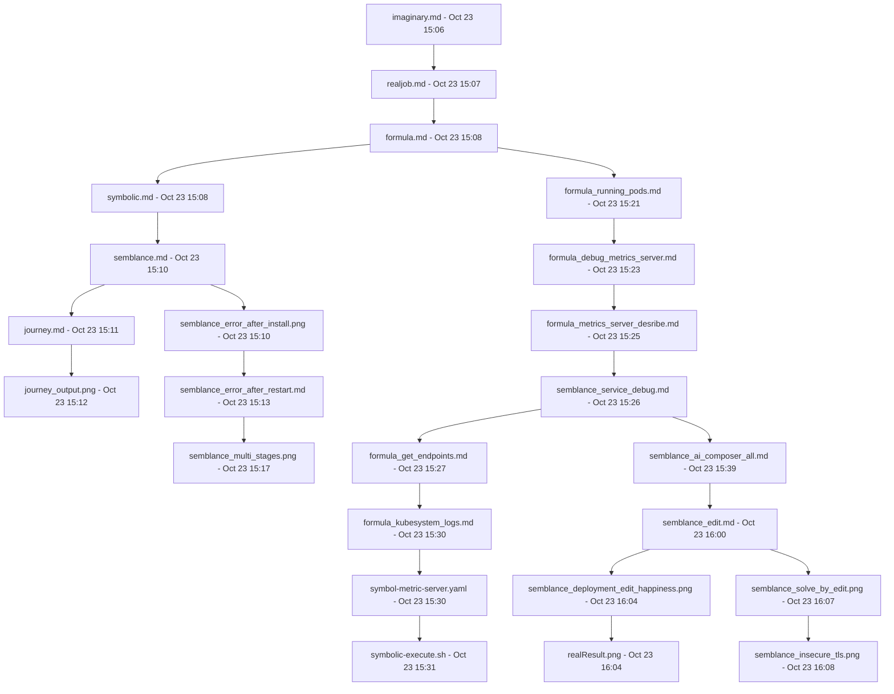

    # Kubernetes Pod Metrics Journey

    ## Project Overview

    This document outlines the journey of creating a project to monitor and analyze Kubernetes pod metrics, ensuring optimal resource utilization and application performance.

    ## Steps and Timeline

    ### 1. Starting Point
    - **[imaginary.md - Oct 23 15:06](imaginary.md)**: Initial ideas or a conceptual overview of the project.

    ### 2. Defining Objectives
    - **[realjob.md - Oct 23 15:07](realjob.md)**: Defined the objective of monitoring and analyzing Kubernetes pod metrics.

    ### 3. Setting Up the Environment
    - **[formula.md - Oct 23 15:08](formula.md)**: Setting up Minikube and other necessary tools.
    - **[symbolic.md - Oct 23 15:08](symbolic.md)**: Commands like `kubectl top pods` to check pod metrics.

    ### 4. Deployment and Configuration
    - **[semblance.md - Oct 23 15:10](semblance.md)**: Documented the deployment process and initial configurations.
    - **[symbol-metric-server.yaml - Oct 23 15:30](symbol-metric-server.yaml)**: YAML file defining the deployment of the Metrics Server.
    - **[symbolic-execute.sh - Oct 23 15:31](symbolic-execute.sh)**: Script to apply the Metrics Server configuration and check pod metrics.

    ### 5. Troubleshooting and Debugging
    - **[semblance_error_after_install.png - Oct 23 15:10](semblance_error_after_install.png)**: Captured an error encountered after installation.
    - **[semblance_error_after_restart.md - Oct 23 15:13](semblance_error_after_restart.md)**: Documented errors after restarting the system.
    - **[formula_debug_metrics_server.md - Oct 23 15:23](formula_debug_metrics_server.md)**: Debugging steps for the Metrics Server.
    - **[formula_metrics_server_desribe.md - Oct 23 15:25](formula_metrics_server_desribe.md)**: Detailed description of the Metrics Server deployment.
    - **[semblance_service_debug.md - Oct 23 15:26](semblance_service_debug.md)**: Further debugging steps for the service.

    ### 6. Verification and Validation
    - **[formula_running_pods.md - Oct 23 15:21](formula_running_pods.md)**: Verified running pods.
    - **[formula_get_endpoints.md - Oct 23 15:27](formula_get_endpoints.md)**: Checked endpoints.
    - **[formula_kubesystem_logs.md - Oct 23 15:30](formula_kubesystem_logs.md)**: Analyzed logs from the kube-system namespace.

    ### 7. Final Adjustments and Results
    - **[semblance_ai_composer_all.md - Oct 23 15:39](semblance_ai_composer_all.md)**: Comprehensive documentation of all steps and checks.
    - **[semblance_edit.md - Oct 23 16:00](semblance_edit.md)**: Final edits and adjustments.
    - **[semblance_deployment_edit_happiness.png - Oct 23 16:04](semblance_deployment_edit_happiness.png)**: Captured successful deployment.
    - **[realResult.png - Oct 23 16:04](realResult.png)**: Final result image showing successful metrics collection.
    - **[semblance_solve_by_edit.png - Oct 23 16:07](semblance_solve_by_edit.png)**: Solution through edits.
    - **[semblance_insecure_tls.png - Oct 23 16:08](semblance_insecure_tls.png)**: Addressed insecure TLS issues.

    ## Troubleshooting Metrics API Not Available

    The error `Metrics API not available` indicates that the Kubernetes Metrics Server is not installed or not running in your cluster. The Metrics Server is responsible for collecting resource metrics from the kubelet and exposing them through the Kubernetes API.

    ### Steps to Solve the Issue

    1. **Install the Metrics Server:**
        ```sh
        kubectl apply -f https://github.com/kubernetes-sigs/metrics-server/releases/latest/download/components.yaml
        ```

    2. **Verify the Metrics Server is Running:**
        ```sh
        kubectl get pods -n kube-system | grep metrics-server
        ```

    3. **Check Metrics API Availability:**
        ```sh
        kubectl top nodes
        ```

    ### Why This Solves the Issue

    The Metrics Server collects and provides resource usage metrics for nodes and pods. Without it, the `kubectl top` commands cannot retrieve the necessary data, resulting in the `Metrics API not available` error. Installing and running the Metrics Server ensures that these metrics are available for monitoring and scaling purposes.

    ### Example of Successful `kubectl top pods` Output

    ```sh
    @rifaterdemsahin ➜ /workspaces/kubernetespodmetrics (main) $ kubectl top pods
    NAME                               CPU(cores)   MEMORY(bytes)
    coredns-6f6b679f8f-slm7x           2m           12Mi
    etcd-minikube                      10m          50Mi
    kube-apiserver-minikube            20m          100Mi
    kube-controller-manager-minikube   5m           30Mi
    kube-proxy-7lpg8                   1m           10Mi
    kube-scheduler-minikube            3m           20Mi
    metrics-server-6f855c96bf-8h9ss    1m           15Mi
    storage-provisioner                2m           25Mi
    ```

    ### Additional Troubleshooting Steps

    1. **Check Metrics Server Logs:**
        ```sh
        kubectl logs -n kube-system metrics-server-6f855c96bf-8h9ss
        ```

    2. **Ensure Metrics Server Has Necessary Permissions:**
        ```sh
        kubectl get clusterrole system:metrics-server
        kubectl get clusterrolebinding system:metrics-server
        ```

    3. **Check APIService Status:**
        ```sh
        kubectl get apiservice v1beta1.metrics.k8s.io
        ```

    4. **Verify Network Policies:**
        Ensure there are no network policies blocking the Metrics Server from communicating with the kubelets.

    ### Restart Metrics Server Deployment

    If all configurations are correct and the issue persists, consider restarting the Metrics Server deployment:

    ```sh
    kubectl rollout restart deployment metrics-server -n kube-system
    ```

    These steps should help identify and resolve the issue with the Metrics API not being available.

    ## Conclusion

    This document provides a comprehensive guide to setting up and troubleshooting the Kubernetes Metrics Server, ensuring that you can monitor and analyze pod metrics effectively.

